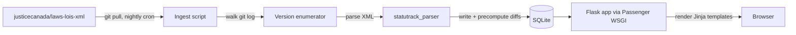

# StatuTrack

**A visual regulatory change tracker for Canadian federal law**

## Overview

StatuTrack is a web application for tracking changes to Canadian federal legislation and regulations over time. It builds on the XML parser already developed against Justice Laws Canada material and adds inline change visualization, similar to how a code review tool shows diffs between versions of a file.

The app addresses a real pain point in compliance work: regulations change, sometimes substantively, and the official consolidated versions on laws-lois.justice.gc.ca do not surface what changed between revisions. Today, tracking what shifted in (for example) the PCMLTFR or the FCPF regulations requires reading the Canada Gazette amendment-by-amendment, manually comparing two PDFs, or paying for a third-party service. StatuTrack offers a free, open, and visually intuitive alternative.

## Problem statement

Compliance professionals, in-house counsel, policy researchers, and law students need to monitor regulatory change. The current options are imperfect:

- Justice Laws Canada publishes consolidated current versions but no diff view.
- Canada Gazette publishes amendments but not in a way that easily overlays onto the consolidated text.
- Paid services (CCH, Westlaw, Practical Law) provide redlines but cost real money and lock content behind logins.
- Manual comparison is slow, error-prone, and impractical at scale.

The `justicecanada/laws-lois-xml` repository on GitHub is an underutilized resource. It contains the XML source for the official consolidated Acts and Regulations, and its **git history is effectively the version history of Canadian federal law**. Every commit is a snapshot of what was in force at that moment. StatuTrack treats this git history as the canonical version archive.

## Vision

The core experience is two views, well executed:

1. **Reader view** for the current consolidated text, with clean typography, working internal links between sections, and a stable URL structure (e.g. `/instruments/SOR-2002-184/section/71`).
2. **Diff view** that shows what changed between any two versions, with additions and deletions highlighted inline at the section level.

A user opening the PCMLTFR record could see at a glance that subsection 71(1) was rewritten in June 2024, what the old text said, what the new text says, and the effective date of the change. Compliance teams could (Phase 2) subscribe to specific regulations and be notified when a change lands.

## Key features

**Core (MVP)**

- Browse all Acts and Regulations available in `justicecanada/laws-lois-xml`.
- View the current consolidated version of any instrument.
- Select any two versions and view an inline section-level diff.
- Section deep-linking and citation-friendly URLs.
- Bilingual support (English and French).
- Full-text search across titles and section content via SQLite FTS5.

**Phase 2**

- Bookmark and follow specific regulations.
- RSS feed of changes to followed regulations.
- Export a redline as PDF or DOCX (useful for compliance evidence files).
- Side-by-side mode in addition to inline mode.
- Private annotation layer for personal notes on sections.

**Phase 3 (stretch)**

- Cross-reference detection where one Act amends another.
- Coming-into-force date overlay distinct from commit date.
- Provincial regulation support via separate data sources per province.

## Technical approach

### Hosting target

StatuTrack runs on a shared cPanel host using the **Setup Python App** feature (Passenger WSGI). The app lives in a Python virtualenv inside the user's home directory, with a dedicated subdomain routed through Passenger to a Flask WSGI app. A single SQLite database, a clone of the upstream `laws-lois-xml` repo, and the parsed data all live alongside the app on the same host.

This constrains the stack to:

- Flask for the web layer (Passenger is WSGI; FastAPI is ASGI and doesn't fit cleanly).
- Jinja2 templates rendered server-side. No React build step.
- SQLite for storage. PostgreSQL adds friction with no payoff at this scale.
- Cron for scheduling.
- All Python dependencies in a per-app virtualenv.

### Data ingestion

Clone `https://github.com/justicecanada/laws-lois-xml.git` into a directory under the home folder, outside the app root so it isn't bundled into Passenger restarts. A nightly cron job runs `git pull`, identifies XML files that changed in the pulled commits, and re-parses only those files. For new files or first-run, the ingestion walks `git log` per file to build the full version history.

Each `(commit hash, file path)` pair is one version. Commit timestamps give an "as-of" date. Metadata-only commits are filtered out so only substantive changes appear in the version timeline.

Because the laws-lois-xml repo is large and the initial ingestion is CPU-heavy, the **first full ingestion runs interactively over SSH** rather than via cron, using `nohup` or `tmux` so it can be monitored and resumed if a session drops. Subsequent incremental ingestions are small and cron-friendly.

If a future cron job ever hits a shared-hosting CPU or time limit, the fallback is to move ingestion off-server (GitHub Actions or a local laptop) and rsync the resulting database up via SSH. The serving layer doesn't change.

### Parser layer

Refactor the existing `laws_xml_to_excel.py` into a reusable library (`statutrack_parser`) that returns a structured Python object representing an instrument: title, enabling authority, sections, subsections, paragraphs, marginal notes, history notes. The existing parser handles most of this; the work is generalizing the output target so Excel is one consumer and the StatuTrack database is another.

### Storage

SQLite, single file, alongside the Flask app. Schema sketch:

- `instruments` (id, short_title, long_title, citation, type, language)
- `versions` (id, instrument_id, commit_hash, effective_date, parsed_at)
- `sections` (id, version_id, section_number, heading, content, parent_section_id)
- `diffs` (id, from_version_id, to_version_id, section_id, change_type, old_text, new_text)
- `sections_fts` virtual table over `sections.content` for full-text search

Diffs are precomputed during ingestion. The serving layer never computes a diff on the fly: it just queries.

### Diff engine

Section-level granularity. Sections are aligned across versions by section number, with a similarity fallback for renumbering. Within matched sections, Python's `difflib.SequenceMatcher` produces a word-level diff that templates render as inline `<ins>` and `<del>` spans. Sections added or removed entirely are flagged as such and rendered with a section-level banner rather than inline highlighting.

### Web layer

Flask app served via Passenger WSGI. Routes:

- `GET /` — landing page with browse and search
- `GET /instruments/<slug>` — reader view (current consolidated version)
- `GET /instruments/<slug>/versions` — version history table
- `GET /instruments/<slug>/compare?from=<v1>&to=<v2>` — inline diff view
- `GET /search?q=...` — full-text search results

Templates use Jinja2 with a small set of partials (header, section, diff section). Tailwind via the Play CDN keeps the build pipeline empty for the MVP. A compiled Tailwind step can be added later if it becomes worth the complexity.

### Architecture



### Deployment

1. In cPanel, run **Setup Python App** with Python 3.11 or the latest version the host offers.
2. Set the app root to `~/apps/statutrack` and the URL to a dedicated subdomain (e.g. `statutrack.yourdomain.com`).
3. Over SSH, activate the virtualenv that Setup Python App created and `pip install -r requirements.txt`.
4. Clone the StatuTrack repo into the app root. `passenger_wsgi.py` at the root imports the Flask app and exposes the WSGI callable as `application`.
5. Clone `laws-lois-xml` to `~/data/laws-lois-xml`, outside the app root.
6. Run the initial ingestion interactively over SSH inside `tmux` or with `nohup`.
7. Add cron entries: nightly `git pull` plus incremental re-ingest, then `touch ~/apps/statutrack/tmp/restart.txt` to reload Passenger.

Routine deploys: `git pull` in `~/apps/statutrack`, then `touch tmp/restart.txt`.

## Implementation phases

| Phase | Scope | Effort |
|---|---|---|
| 0. cPanel + repo setup | Setup Python App, subdomain, virtualenv, clone StatuTrack and laws-lois-xml, hello-world Flask route through Passenger | 1 day |
| 1. Parser refactor | Extract `statutrack_parser` library from the existing Excel script | 2 to 3 days |
| 2. Ingestion pipeline | Git history walker, parser integration, SQLite schema, precomputed diffs | 4 to 6 days |
| 3. Flask reader view | Browse, instrument view, table of contents | 3 to 4 days |
| 4. Flask diff view | Version picker, inline diff rendering, section banners for adds and removes | 3 to 4 days |
| 5. Search + polish | SQLite FTS5 full-text search, bilingual handling, cron setup, deployment docs | 3 to 5 days |

MVP total: roughly 4 to 6 weeks of part-time work.

## Use cases

- **AML/ATF.** Track changes to the PCMLTFA and PCMLTFR. When FINTRAC issues new guidance, immediately cross-reference the underlying regulatory text and see whether the regulation itself has been amended recently.
- **Privacy.** Monitor PIPEDA and the transition to Bill C-27 (CPPA and AIDA). StatuTrack would make the transition visible section-by-section.
- **Consumer protection in banking.** The Financial Consumer Protection Framework brought substantive disclosure obligation changes into the Bank Act in 2022; StatuTrack is built to surface that kind of change clearly.
- **Academic and policy research.** Researchers studying how surveillance, privacy, or financial regulation has evolved gain a machine-readable, diff-ready archive.

## Open questions

- **Renumbered sections.** When a regulation is restructured and section 5 becomes section 7, follow the content or the number? Probably content, using a similarity threshold to detect renumbering.
- **Bilingual diffs.** Show English and French diffs in separate views with a language toggle, to keep each legible.
- **What counts as a version.** Filter to commits that change substantive content, ignoring metadata-only commits.
- **Initial ingestion runtime.** A full historical ingest of all federal regulations could take hours on a shared host. Run it overnight over SSH inside `tmux` and treat full re-ingestion as a manual event triggered by schema changes.

## Repository structure

```
StatuTrack/
  README.md
  PROPOSAL.md
  pyproject.toml
  requirements.txt
  passenger_wsgi.py        # Passenger WSGI entry point
  statutrack/
    __init__.py
    parser/                # refactored XML parser
    ingest/                # git history walker + ingestion
    diff/                  # diff engine
    web/
      __init__.py          # Flask app factory
      routes.py
      templates/
      static/
    db/                    # schema and migrations
  scripts/
    bootstrap.sh           # clone laws-lois-xml, initialize db
    ingest.py              # run ingestion (cron entry)
    refresh.sh             # git pull + incremental ingest + restart
  tests/
  .github/workflows/       # tests + lint
```

## Next steps

1. Initialize the GitHub repo at `patrick-mikk/StatuTrack` and commit this proposal as `PROPOSAL.md`.
2. In cPanel, run **Setup Python App** with the latest available Python, pointed at a fresh subdomain. Confirm the default Passenger app responds before adding any code.
3. Clone `StatuTrack` into the app root and `laws-lois-xml` into `~/data/laws-lois-xml`.
4. Refactor `laws_xml_to_excel.py` into the `statutrack_parser` library.
5. Stand up the ingestion pipeline against PCMLTFR as a first test case. Substantively interesting, frequently amended, directly relevant to day-job work, and small enough to iterate on quickly.
6. Build the reader view and diff view in parallel once the data layer is stable.
